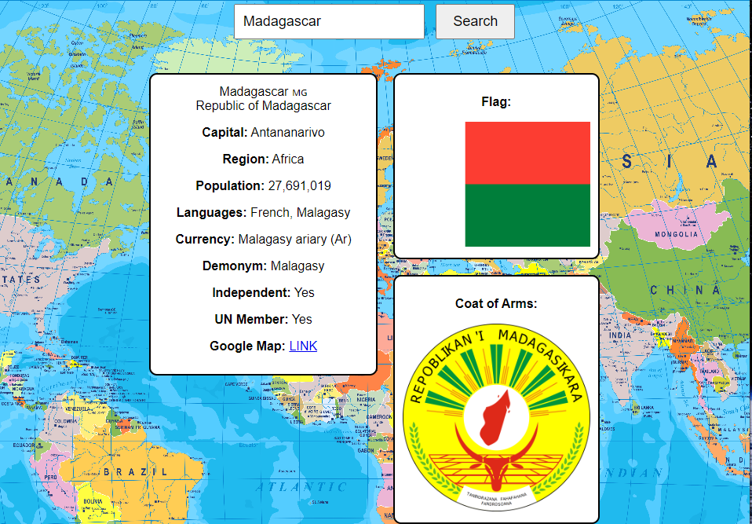

# Digital Atlas

Users can retrieve information such as population, language, flag, etc. about an existing country.

## Table of contents

- [Getting Started](#getting-started)
- [Available Scripts](#available-scripts)
- [Screenshot](#screenshot)
- [Tools](#built-with)
- [Links](#links)
- [Author](#author)

## Getting Started

The project was created using HTML, CSS, and JavaScript.

## Available Scripts

In the project directory, you can run:

### `npm start`

Open [http://localhost:3000](http://localhost:3000) to view it in your browser.

### `Ctrl + C`

Ends server

## Screenshot

## Built with

- HTML
- CSS
- Node.js
- Express.js
- API

## Links

Streamer's Channel: [Mayan Wolfe](https://www.twitch.tv/mayanwolfe)
API: [Rest Country](https://restcountries.com/)

## Author

- LinkedIn - [@avion-cobb](https://www.linkedin.com/in/avion-cobb/)
- Twitter - [@Blvck_Lotus003](https://twitter.com/Blvck_Lotus003)
